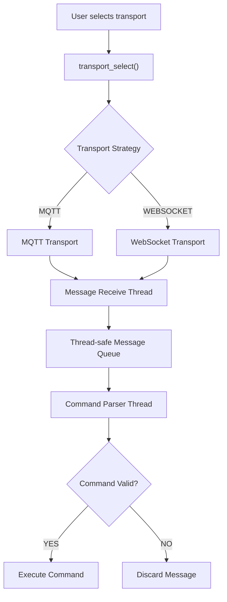
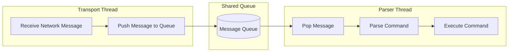
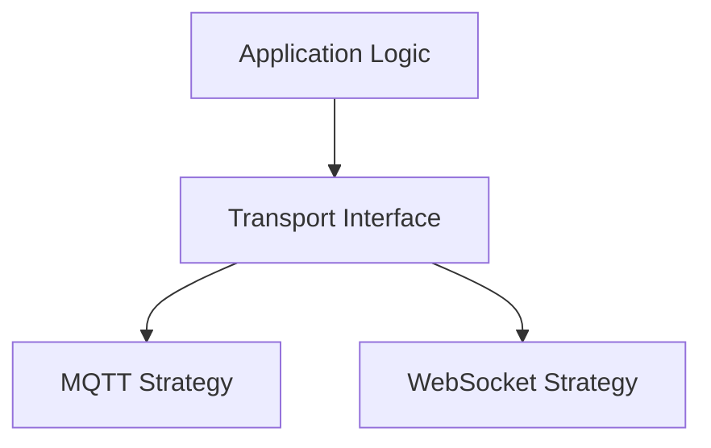
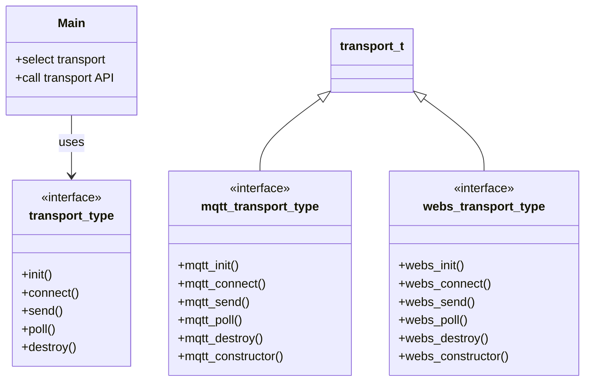

# Modular MQTT / WebSocket Command Framework (C)

A modular communication framework written in **C** that supports
**MQTT** and **WebSocket** transports for receiving and executing
commands from external devices or services.

The project demonstrates **embedded-style architecture**, including
protocol abstraction, multi-threaded message processing, and modular
design using opaque structs and function tables.

This project was developed as part of an **embedded software engineering
portfolio** to demonstrate system architecture, concurrency, and
testable design in C.

------------------------------------------------------------------------

# Overview

The program receives commands from external systems over a network
transport layer and executes them within the application.

Supported transports:

-   MQTT
-   WebSocket

The transport backend is selected **at runtime** based on user input.
The application itself remains **protocol-agnostic**.

Incoming messages are placed into a **thread-safe shared queue**, where
they are processed by a dedicated **command parser thread**.

This design separates network I/O from command execution and allows the
transport layer to be replaced without modifying application logic.

------------------------------------------------------------------------

# System Architecture

------------------------------------------------------------------------

# Thread Interaction

------------------------------------------------------------------------

# Key Design Concepts

## Strategy Pattern for Transport Layer

The communication layer is implemented using the **Strategy design
pattern**.

The application interacts with a common **transport interface**, while
concrete implementations provide protocol-specific behavior.

The application does not need to know which transport is active.

Benefits:

-   Protocol abstraction
-   Runtime transport selection
-   Clean separation of concerns
-   Easier testing and extensibility

------------------------------------------------------------------------

## Opaque Struct Architecture

Transport objects are implemented using **opaque structs** to enforce
encapsulation.

Conceptually:

The application only interacts with the **base transport interface**.

This mirrors object-oriented polymorphism implemented in **pure C**
using function pointers.

------------------------------------------------------------------------

## Multi-Threaded Message Processing

The program separates networking and command execution into different
threads.

**Transport Thread** - Handles MQTT/WebSocket communication - Receives
incoming messages - Pushes messages into a shared queue

**Command Parser Thread** - Reads messages from the queue - Validates
commands - Executes valid commands or discards invalid input

This architecture prevents network I/O from blocking command processing.

------------------------------------------------------------------------

# Features

-   Modular C architecture
-   Runtime-selectable transport layer
-   Strategy pattern using function tables
-   Opaque structs for encapsulation
-   Multi-threaded message processing
-   Thread-safe queue with mutex synchronization
-   Command validation and parsing
-   Protocol-independent application layer

------------------------------------------------------------------------

# Project Structure

project/ │ ├── src/ │ ├── main.c │ ├── transport_select.c │ ├──
mqtt_transport.c │ ├── websocket_transport.c │ ├── command_parser.c │
├── message_queue.c │ ├── include/ │ ├── transport.h │ ├──
command_parser.h │ ├── message_queue.h │ ├── tests/ │ ├── test_parser.c
│ ├── test_queue.c │ ├── test_transport_select.c │ └── README.md

------------------------------------------------------------------------

# Testing

Unit tests focus on core logic:

-   command parsing
-   message validation
-   queue operations
-   transport selection

These tests verify system behavior independently of the network layer.

------------------------------------------------------------------------

# Example Commands

SET TEMP 25\
LED ON\
LED OFF\
STATUS

Invalid or malformed commands are safely ignored.

------------------------------------------------------------------------

# Technologies Used

-   C
-   POSIX Threads (pthreads)
-   MQTT (libmosquitto)
-   WebSockets
-   Mutex synchronization
-   Function pointer tables
-   Opaque struct architecture

------------------------------------------------------------------------

# Purpose

This project demonstrates techniques commonly used in **embedded and
systems programming**:

-   Polymorphic interfaces in C
-   Protocol abstraction layers
-   Thread-safe concurrent systems
-   Modular architecture for maintainability and testing

------------------------------------------------------------------------

# Future Improvements

-   Integration tests with local MQTT broker
-   Mock transport layer
-   Additional transports (UART, TCP, CAN)
-   Continuous integration with automated tests

------------------------------------------------------------------------

# License

MIT License
